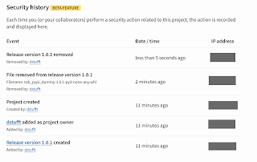
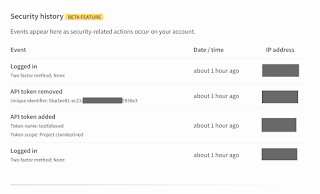

To help you check for security problems, [PyPI](https://pypi.org/) is adding an advanced audit log of user actions beyond the current (existing) journal. This will, for instance, allow publishers to track all actions taken by third party services on their behalf. This beta feature is live now on [PyPI](https://pypi.org/) and on [Test PyPI](https://test.pypi.org/). **Background:**  
We're [further](https://pyfound.blogspot.com/search/label/pypi) increasing the security of the Python Package Index with another new beta feature: an audit log of sensitive actions that affect users and projects. This is thanks to a [grant from the Open Technology Fund](https://pyfound.blogspot.com/2019/03/commencing-security-accessibility-and.html), coordinated by the [Packaging Working Group](https://wiki.python.org/psf/PackagingWG) of the [Python Software Foundation](https://www.python.org/psf-landing/). **Details:**  

<table align="center" cellpadding="0" cellspacing="0"><tbody><tr><td></td></tr><tr><td>Project security history display, listing events (such as "file removed from release version 1.0.1") with user, date/time, and IP address for each event.</td></tr></tbody></table>

We're adding a display so you can look at things that have happened in your user account or project, and check for signs someone's stolen your credentials. In your [account settings](https://pypi.org/manage/account/), you can view a log of sensitive actions from the last two weeks that are relevant to your user account, and if you are an [Owner](https://pypi.org/help/#collaborator-roles) at least one project on PyPI, you can go to that project's Manage Project page to view a log of sensitive actions (performed by *any* user) relevant to that project. (And PyPI site administrators are able to view the full audit log for all users and all projects.) Please [help us test this](https://wiki.python.org/psf/WarehousePackageMaintainerTesting), and report issues.

<table align="center" cellpadding="0" cellspacing="0"><tbody><tr><td></td></tr><tr><td>User security history display, listing events (such as "API token added") with additional details (such as token scope), date/time, and IP address for each event.</td></tr></tbody></table>

**In beta:**  
We're still refining this and may fail to log, or to properly display, events in the audit log. And the sensitive event logging and display starting on 16 August 2019, so you won't see sensitive events from before that date. (Read more technical details about implementation in [the GitHub issue](https://github.com/pypa/warehouse/issues/5863).) **Next:**  
We're continuing to refine [all our beta features](https://pypi.org/help/#beta-badge), while working on [accessibility improvements](https://github.com/pypa/warehouse/milestone/15) and starting to work on [localization](https://github.com/pypa/warehouse/milestone/14) on PyPI. Follow our progress reports in more detail [on Discourse](https://discuss.python.org/t/pypi-security-work-multifactor-auth-progress-help-needed/1042/).
