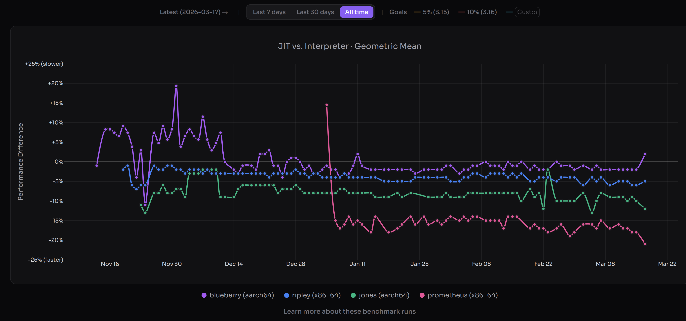
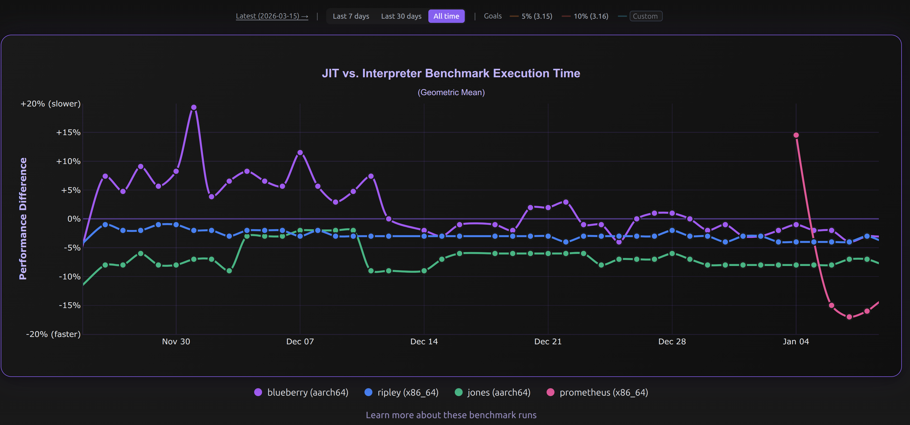

This was [originally posted](https://fidget-spinner.github.io/posts/jit-on-track.html) on [Ken Jin's Blog](https://fidget-spinner.github.io/).

---

(JIT performance as of 17 March (PST). Lower is better versus interpreter. Image credits to [doesjitgobrrr.com](https://doesjitgobrrr.com/)).

Great news---we've hit our (very modest) performance goals for the CPython JIT over a year early for macOS AArch64, and a few months early for x86_64 Linux. The 3.15 alpha JIT is about **11-12%** faster on macOS AArch64 than the tail calling interpreter, and **5-6%** faster than the standard interpreter on x86_64 Linux. These [numbers](https://doesjitgobrrr.com/run/2026-03-17) are geometric means and are preliminary. The actual range is something like a **20% slowdown to over 100% speedup** (ignoring the ``unpack_sequence`` microbenchmark). We don't have proper free-threading support yet, but we're aiming for that in 3.15/3.16. The JIT is now back on track.

**I cannot overstate how tough this was**. There was a point where I was seriously wondering if the JIT project would ever produce meaningful speedups. To recap, the original CPython JIT had practically no speedups: 8 months ago I posted a [JIT reflections article](https://fidget-spinner.github.io/posts/jit-reflections.html) on how the original CPython JIT in 3.13 and 3.14 was often slower than the interpreter. That was also around the time where the Faster CPython team lost funding by its main sponsor. I'm a volunteer so this didn't affect me, but more importantly it did affect my friends working there, and at a point of time it seemed the JIT's future was uncertain.

So what changed from 3.13 and 3.14? I'm not going to give some heroic tale of how we rescued the JIT from the jaws of failure through our acumen. I honestly attribute a lot of our current success to luck---right time, right place, right people, right bets. I seriously don't think this would've been possible if a single one of the core JIT contributors: Savannah Ostrowski, Mark Shannon, Diego Russo, Brandt Bucher, and me were not in the picture. To not exclude the other active JIT contributors, I will also name a few more people: Hai Zhu, Zheaoli, Tomas Roun, Reiden Ong, Donghee Na, and I am probably missing a few more.

I'm going to cover a lesser talked about part of a JIT: the people, and a bit of luck. If you want the technical details of how we did it, it's [here](https://fidget-spinner.github.io/posts/faster-jit-plan.html).

## Part 1: A community-led JIT

The Faster CPython team lost its main sponsor in 2025. I immediately [raised the idea of community stewardship](https://discuss.python.org/t/community-stewardship-of-faster-cpython/92153). At the time, I was pretty uncertain this would work. JIT projects are not known to be good for new contributors. It historically requires a lot of prior expertise.

At the CPython core sprint in Cambridge, the JIT core team met, and we [wrote a plan](https://fidget-spinner.github.io/posts/faster-jit-plan.html) for a 5% faster JIT by 3.15 and a 10% faster JIT by 3.16, with free-threading support.
A side note, which was less headline grabbing, but vital to the health of the project: was to **decrease the bus factor**. We wanted 2 active maintainers in all 3 stages of the JIT; frontend (region selector), middle-end (optimizer), backend (code generator).

Previously, the JIT only had 2 active recurrent contributors middle-end. Today, the JIT has 4 active recurrent contributors to the middle-end, and I would consider the 2 non-core developers (Hai Zhu and Reiden) capable and valued members.

What worked in attracting people were the usual software engineering practices: breaking complex problems down into manageable parts. Brandt started this earlier in 3.14, where he opened multiple [mega-issues](https://github.com/python/cpython/issues/131798) that split optimizing the JIT into simple tasks. E.g. we would say "try optimizing a single instruction in the JIT". I took Brandt's idea and did this for 3.15. Luckily, I had an easier job as my issue involved converting the interpreter instructions to an easily optimizeable form. To encourage new contributors, I also laid out [very detailed instructions](https://github.com/python/cpython/issues/134584) that were immediately actionable. I also clearly demarcated units of work. I suspect that did help, as we have 11 contributors (including me) working on that issue, converting nearly the whole of the interpreter to something more JIT-optimizer friendly. The core was that the JIT could be broken down from an opaque blob to something that a C programmer with no JIT experience could contribute to.

Other things that worked: encouraging people, celebrating achievements big or small. Every JIT PR had a clear outcome, which I suspect gave people a sense of direction.

The community optimization efforts paid off. The JIT went from 1% faster on x86_64 Linux to 3-4% faster (see the blue line below) over that time period:

(Image credits to [doesjitgobrrr.com](https://doesjitgobrrr.com/)).

## Part 2: Lucky bets

### Trace recording
Again, I attribute a lot of this to luck, but during the CPython core sprints in Cambridge, Brandt nerd-sniped me to rewrite the JIT frontend to a tracing one. I initially didn't like the idea, but as a friendly form of spite-driven-development, I thought I'd rewrite it just to prove to him it didn't work.

The initial prototype worked in 3 days, however it took a month to get it JITting properly without failing the test suite. The initial results were dismal---about 6% slower on x86_64 Linux. I was about to ditch the idea, until a lucky accident happened: I misinterpertered a suggestion given by Mark.

Mark had suggested earlier to thread the dispatch table through the interpreter, thus having two dispatch tables in the interpreter (one normal interpreter, and one for tracing). Mark suggested we should have the tracing table be tracing versions of normal instructions. However, I misunderstood and came up with an even more extreme version: instead of tracing versions of normal instructions, I had only one instruction responsible for tracing, and all instructions in the second table point to that. Yes I know this part is confusing, I'll hopefully try to explain better one day. This turned out to be a really really good choice. I found that the initial dual table approach was so much slower due to a doubling of the size of the interpreter, causing huge compiled code bloat, and naturally a slowdown. By using only a single instruction and two tables, we only increase the interpreter by a size of 1 instruction, and also keep the base interpreter ultra fast. I affectionally call this mechanism dual dispatch.

There's a lot more that went into the design of the trace recording interpreter. I'm tooting my own horn here, but I truly think it's a mini work of art. It took me 1 week to iterate on the interpreter until it was overall faster. It went from 6% slower to roughly no speedup after using dual dispatch. After that, I stamped out a bunch of slow edge cases in the tracing interpreter to eventually make it 1.x% faster. Tracing the interpreter itself is only 3-5x slower by my own estimations than the specializing interpreter. Key to this is that it respects all normal behavior of the specializing interpreter and mostly doesn't interfere with it.

Just to give you an idea of how much trace recording mattered: it increased the JIT code coverage by 50%. This means all future optimizations would likely have been around 50% less effective (assuming all code executes the same, which of course isn't true, just bear with me please :).

So I have to thank Brandt and Mark for leading me to stumble upon such a nice solution.

### Reference count elimination

The other lucky bet we made early on was to try reference count elimination. This, again, was work originally by Matt Page done in CPython bytecode optimizer (more details in previous blog post on optimization). I noticed that there was still a branch left in the JITted code per reference count decrement even with the bytecode optimizer work. I thought: "why not try eliminating the branch", and had no clue how much it would help. It turns out a single branch is actually quite expensive and these add up over time. Especially if it's >=1 branch for every single Python instruction!

The other lucky part is how easy this was to parallelize and how great it was a tool to teach people about the interpreter and JIT. This was the main optimization that we directed people to work on in the Python 3.15 JIT. Although it was a mostly manual refactoring process, it taught people the key parts they needed to learn about the JIT without overhwhelming them.

## Part 3: A great team

We have a great infrastructure team. I say this partly in jest, because it's one person. In reality, our "team" is currently 4 machines running in Savannah's closet. Nevertheless Savannah has done the work equivalent of an entire infrastructure team for the JIT. The JIT could not have progressed so quickly if we had nothing to report our performance numbers. Daily JIT runs have been a game changer in the feedback loop. It helped us catch [regressions](https://github.com/python/cpython/pull/143268) in JIT performance, and lets us know our optimizations actually work.

Mark is technically excellent, and I think he knows the Internet gives him too much praise already so I'm not going to say anything more here :).

Diego is also great. He's responsible for the JIT on ARM hardware, and also has recently started work on making the JIT friendly to profilers. I cannot overstate how hard of a problem this is.

Brandt laid the original foundation for our machine code backend, without which we'd have new contributors writing assembler, which probably would've put more people off.

## Part 4: Talking to people

I also want to encourage the idea of talking to people and sharing ideas.

A shoutout to CF Bolz-Tereick, who taught me a lot about PyPy. I spent a few months looking at PyPy's source code, and I believe this made me a better JIT developer overall. CF was very helpful when I needed help.

I'm also part of a friendly compiler chat with Max Bernstein, without which I'd likely have lost motivation for this a long time ago. Max is a prolific writer, and a friendly compiler person.

Ideas don't exist in a silo. I suspect I became better at writing JITs thanks to hanging out with a bunch of compiler people for some time. At the very least, looking at PyPy has broadened my view!

# Conclusion

People are important, and with some luck, [JIT go brrr](https://doesjitgobrrr.com/).
