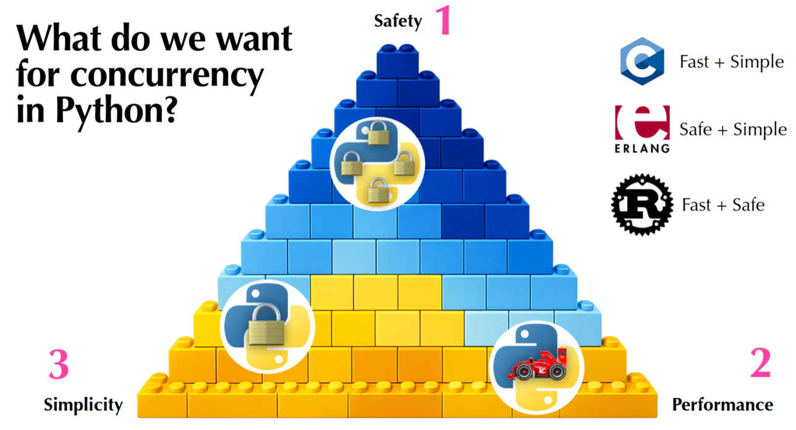

Tobias Wrigstad and Fridtjof Stoldt returned to the Python Language Summit, now joined by Donghee Na. Tobias and Fridtjof previously presented “[Fearless Concurrency](https://pyfound.blogspot.com/2025/06/python-language-summit-2025-fearless-concurrency.html)” to the Python Language Summit in 2025. This year the topic at hand was the “post-Free-Threading era of Python”, and what high-level concurrency primitives would be provided by Python.

## Comfortable doesn’t mean “Good”

Today the interface for accessing free-threading is, unsurprisingly, “threads”. Threads are how people typically first learn about true parallelism from school, textbooks, and other familiar materials. But what if threads as a user interface aren’t very good? Using threads means users need to care about deadlocks and race conditions.

Python’s free-threading project has made considerable progress since [PEP 779](https://peps.python.org/pep-0779/)’s acceptance. But there was one aspect of PEP 779’s acceptance criteria that hadn’t been addressed yet: high-level concurrency primitives. The complete message from the Steering Council’s acceptance stated:

> Preparation for high-level concurrency primitives. \
> The Python core team should begin considering and proposing higher-level concurrency primitives that users can use safely and effectively, without requiring a deep understanding of the underlying threading mechanism. And the SC wishes that this task should be prioritized once the above tasks are stable. We recommend using the `concurrent` package in the stdlib for this, where appropriate.

There is some prior art here; other programming languages provide primitives Python can be inspired by, such as Rust’s ownership and borrowing, Go with channels and goroutines, and Erlang with actors and sending messages.


## Fast, Simple, or Safe: what should Python concurrency be?

The talk opened by contrasting approaches to implementing concurrency in different programming languages on three separate axes that are “sometimes at odds with each other”: speed, simplicity, and safety.

C is fast and simple, offering direct access to memory through pointers, which also allows dangerous and unsafe operations; C relies on programmer discipline for program correctness. Erlang has multiple threads, but to communicate, data is copied over to the other “actor”, so it’s safe and simple, but performance suffers. Rust is performant and safe, but it’s not simple: “you’ll find yourself often fighting with the [borrow checker](https://doc.rust-lang.org/book/ch04-00-understanding-ownership.html)”.



“Where would we put Python on this triangle?”

Python using the [Global Interpreter Lock (GIL)](https://docs.python.org/3/glossary.html#term-global-interpreter-lock) (represented as a single lock on the graphic) is a simple model, but it’s not completely safe, as the GIL “only protects the runtime”. [Subinterpreters](https://docs.python.org/3/library/concurrent.interpreters.html) (represented as multiple locks on the graphic) as a model are safer due to the isolation, but this model isn’t simple or performant due to data copying. Finally, there is [free-threaded Python](https://docs.python.org/3/howto/free-threading-python.html) (racecar in the graphic), which is very similar to C: simple and performant, but it puts the burden on programmers for program correctness and safety.

The three argued that for a high-level model “safety would be a priority and then performance”, with “simplicity as third”. “Simplicity is at odds with performance”.

## Behavior-Oriented Concurrency (BOC)

Behavior-Oriented Concurrency (BOC) is the model the trio is proposing for a high-level concurrency interface for Python. Programs written with the BOC model are task-based. Tasks are lightweight, can run on any core, and cannot deadlock.

Each task owns data that is protected by mutexes, but unlike the [`threading.Lock`](https://docs.python.org/3/library/threading.html#lock-objects) objects that we’re used to in Python, these mutexes are aware of the data that they protect. This data awareness means that the mutexes can ensure that the data objects are only accessed by a single task at a time, providing isolation and preventing data races. BOC calls these mutexes “Cowns”, meaning “concurrent owner”.

BOC allows defining which mutexes a task depends on using the `@when` decorator. One or more mutexes can be specified in this decorator, and tasks can only access data through mutexes that the task depends on. This mechanism is what allows BOC to create a dependency graph across all tasks and data.

Providing a scheduler with a program written with the above constraints gets you three important properties: no deadlocks, no data races, and good “locking discipline”. The user “wouldn’t need to decide to spawn a thread or subinterpreter”; this would be handled by the runtime. The scheduler would be able to turn detected deadlocks or data races into exceptions instead, detecting these situations ahead of execution.

Some examples of programs written using locks and threads were then transformed into programs using the BOC model, such as two bank accounts transferring money between them and printing the results:

There are [many more examples available on GitHub](https://github.com/microsoft/bocpy/tree/main/examples). This proof of concept, implemented using subinterpreters, is available for anyone to try: [bocpy](https://microsoft.github.io/bocpy), available on the [Python Package Index](https://pypi.org/project/bocpy):

```commandline
$ python -m pip install bocpy
```

Checking bocpy against their own criteria of simplicity, safety, and performance: bocpy is simple, as can be seen in the above examples. On the safety front, bocpy today runs in “stable Python”, and for this reason only isolation has been implemented so far. “We don’t yet have ownership, you can’t implement [ownership] as a third-party library”, as this would require changes to the runtime. Performance is “good for programs that aren’t communication dominated” due to “communication being expensive for subinterpreters”.

The bocpy package provides three features:

* “[Cowns](https://microsoft.github.io/bocpy/#cowns)”, or locks with ownership
* [Behaviors](https://microsoft.github.io/bocpy/#behaviors) (the tasks spawned with `@when` decorators)
* Scheduler (implemented with subinterpreters, with planned support for free-threading)

Looking forward, the three have two other proofs of concept that modify the Python runtime “to allow for safe concurrency and create safe abstractions while keeping performance”. The first implements isolation by organizing the heap into isolated groups of objects, where ownership violations would raise an exception from Cowns. The second is for immutability of Python objects ([PEP 795](https://peps.python.org/pep-0795/)).

The group made it clear that changes to core Python would be needed to support safe concurrency, asking whether Python would trade “some performance for safety”. What primitives do we want to provide in the standard library; are locks enough? And if we do provide primitives, should they be something like bocpy?

## Discussion

Thomas Wouters recalled that the core team “has experience trying to create universal interfaces for subprocesses, multiprocessing, threading”. In practice, there are always corner cases, and performance is suboptimal because of the constraints of the APIs. Thomas asked “how confident [the three] are that this isn’t the case for bocpy?” The three shared Thomas’s concern. “This is a question we’re working on”, answered Fridtjof. “If you have [the bocpy] ownership model it’s possible to treat subinterpreters and threads similarly, you can have communication, and you can share objects directly with the ownership model”.

“Notion of tasks and schedulers immediately brings async to my head”, David Hewitt said, wondering “how does async fit into this picture?” He asked the trio whether bocpy “should be built on [`asyncio`](https://docs.python.org/3/library/asyncio.html)” and have “async mutex primitives instead of being [synchronous]”. Tobias confirmed that bocpy “could be” built using `asyncio`: “it depends on what backend infrastructure” is used and the trade-offs of each backend. “If you want to do some I/O, you tell the I/O library to put something into a Cown once data is available and schedule a task to run when the data is available to avoid blocking”.

Larry Hastings was “happy to see this research going on” and welcomed more from the group, but didn’t see bocpy or any singular solution as “the” method to do concurrency in Python. “[Larry] would like Python to have all the tools that give you and other groups with competing ideas the ability to implement ideas and provide them to users”. Instead, Larry was wary of “anointing a single way”, to avoid locking Python into a particular implementation in case better options are discovered later. Donghee shared that the group wasn’t initially trying to force a single way, only to start the conversation.

Fridtjof brought up Rust as an example of where not providing high-level primitives on top of `async` and `await` resulted in a “split” in the Rust ecosystem. “Sounds lively”, Larry responded.

David Hewitt shared that a lot of the Rust community regards the “Rust async situation” as “slightly failed”, as the standard library lacked any standard interface for the runtime. As a result, the entire Rust ecosystem has been “forced” to converge on [Tokio](https://tokio.rs/). David agreed with Thomas that it would be “tough to come up with a good abstraction”, but that this “doesn’t mean we shouldn’t try”.
