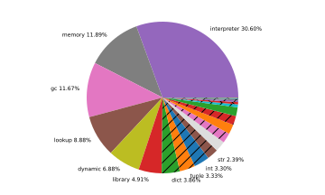

The third Language Summit talk was brought by Mark Shannon, who is the author of the [incremental garbage collector](https://github.com/python/cpython/issues/108362) implementation shipped in Python 3.14 that was [reverted back to the generational garbage collector](https://discuss.python.org/t/reverting-the-incremental-gc-in-python-3-14-and-3-15/107014) from Python 3.13 after reports of “significant memory pressure” in production environments. The original goal of the new incremental garbage collector was to reduce maximum pause times by an order of magnitude for larger heaps.

Mark’s talk opened with a graph about where Python spends its time, split between the interpreter, lookups, modules, and the focus of the talk: garbage collection, which takes around 11.67% of execution time. Mark remarked that even if the [Just-in-Time (JIT) compiler](https://peps.python.org/pep-0744/) makes the interpreter faster (representing 30.6% of time), we’ll unfortunately still have to worry about memory management and garbage collection to make the runtime faster: Mark’s talk was about minimizing the time spent doing these tasks.

What does Python’s garbage collector do today? Funnily enough, this ~12% of time spent is not Python’s primary garbage collection mechanism; [reference counting](https://docs.python.org/3/glossary.html#term-reference-count) is. The garbage collector is a “backup” and “should be much faster”. Reference counting is already collecting dead objects, therefore the garbage collector should only have to find dead unreachable cycles.

Mark emphasized pause times during garbage collection, a metric which the incremental garbage collector aimed to improve, as a major issue for servers and applications with a user interface. The incremental garbage collector reduced peak pause times during garbage collection to “tens of milliseconds”, down from “around 3 seconds for the current generational garbage collector”.

So how would we know whether we’ve improved the garbage collector? Mark defined a term “effectiveness” along with other definitions that will be useful for thinking about different approaches to garbage collection:

* **Scavenge**: This is the minimal garbage collector operation. Give the garbage collector a set of objects and all unreachable cycles are collected. At a high level, users don’t have to worry about how the garbage collector accomplishes this task.
* **Scavenge Effectiveness**: This is the metric being optimized for, calculated as “objects collected” divided by the “number of objects visited”. The effectiveness of the two Python garbage collectors is “pretty poor”, with the old generational GC at 0.3% effectiveness and the reverted incremental GC at ~1% effectiveness.
* **Generational hypothesis**: The assumption that “most objects die young”, which garbage collectors can use to be more effective. However, the exact profile depends on the program being executed.
* **Spaces**: Grouping of objects that are consecutively allocated. All new objects are added to the newest “space”. Spaces have a defined size, and once they are full, the GC can begin scavenging the space and a new empty space is created for newly created objects to be added to. The period when spaces are closed to new objects is a good opportunity to scavenge, as no scavenge operations can occur on an open space.
* **Generation**: A group of consecutive spaces. Generations are much fewer than spaces and typically baked into the garbage collector. Spaces only move in one direction through generations.

Hood Chatham wondered about the “effectiveness” of other garbage collectors compared to Python’s. Mark noted that direct comparison between other programming language garbage collectors and Python would be “unfair”, because “nobody else does reference-counting *and* garbage collection”.

Mark then turned to explaining the now-reverted incremental garbage collector. This garbage collector was a non-generational collector, meaning there was only a single generation that contained the whole heap. This made the incremental garbage collector “effective” because spaces that have existed for longer tend to have more objects collected. The trade-off is that non-generational GCs have a negative impact on memory usage.

## Can we have the best of both worlds?

Generational garbage collectors have lower memory usage overall but suffer from higher pause times, whereas incremental garbage collectors pause for less time but at the expense of more memory. What should Python do as a default?
Mark’s final proposal included how he’d interleave the concepts of generational and incremental garbage collectors to achieve the best of both:

* Two generations: one “young” and one “old”.
* Alternate between young and old generation incremental scavengers.
* Fix the “young” generation as 20MB in size initially.
* Scavenge the old generation at twice the young generation survivor rate.

Donghee Na was concerned that any changes to the garbage collector would cause issues for someone. Donghee wondered whether there was a way to implement a transition period between different garbage collectors. Mark answered that there’s nothing inherently “wrong” with the current garbage collector and that the primary issue would be that there would be “more code to maintain”, but he would prefer providing a GC that is better by default unless users are fine-tuning the GC themselves.

Donghee asked whether configuration options similar to what is available for [JVM garbage collectors](https://docs.oracle.com/en/java/javase/21/gctuning/) could be made available so users could tweak settings to fit their needs. Mark didn’t think this should be necessary; in JVM languages the GC is “the whole thing”, compared to Python where GC is only the “backup” behind reference counting.

Jukka signaled his interest in helping Mark and asked about existing applications that had fine-tuned their GC, noting that these fine-tunings “go stale” whenever the GC changes, even if the new GC is better on average. Mark hoped that if done correctly, Python could remove the need to fine-tune GCs.

Gregory P. Smith lamented that adding [public APIs for the garbage collector](https://docs.python.org/3/library/gc.html) and allowing fine-tuning inhibits being able to improve the general case. Greg also didn’t want to support multiple GC implementations like the JVM does. Greg’s biggest takeaway from the incremental GC revert in Python 3.14 is that there are use-cases which are served well by one GC and not by another, and “those cases should be in our test suite”.

Tobias Wrigstad suggested a potential fine-tuning mechanism that was already being adopted by Java: providing the garbage collector with an explicit “CPU budget”. The mechanism “seemed fairly intuitive”, but it also has the unfortunate side effect of letting users tune their GC “such that it cannot collect all the dead memory”.

Pablo Galindo Salgado had run into issues with the GC and saw success with being able to fine-tune GC generations live in production to get instantaneous feedback. Thomas Wouters (shocking his fellow Steering Council members) agreed with Pablo on being able to fine-tune the garbage collector to “remediate pathological GC behavior”, also adding that this was a common blocker for being able to upgrade Python versions. Mark was interested in these numbers: “let’s get those before moving forward with any decisions”.

Larry Hastings asked about concurrent or “lock-free” garbage collectors and whether there’s a possibility for this to happen in Python. “Memory back for free sounds like a wonderful sales pitch”. Unfortunately, in addition to being “really hard” to implement (which Larry countered with “I heard you were smart”), Mark shared that [C extensions](https://docs.python.org/3/extending/index.html) can “do whatever they want”, which would interfere with a lock-less concurrent collector. Tobias agreed that concurrent lock-less GCs would be “extremely invasive”, including needing to add metadata embedded in every pointer.
