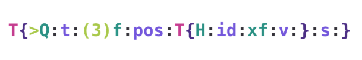
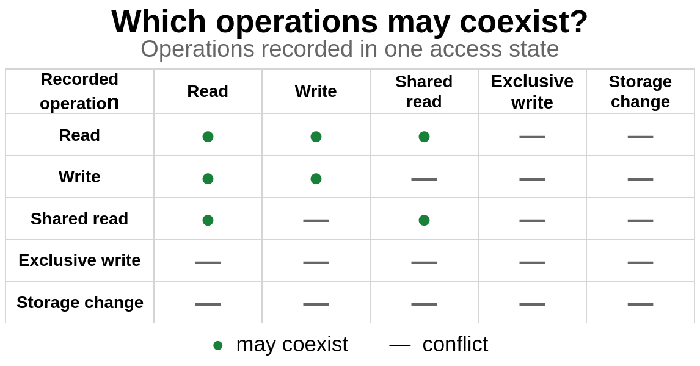

The [Python Buffer Protocol](https://docs.python.org/3/c-api/buffer.html) defines the semantics for accessing the underlying memory buffer of Python objects such as `bytes`, `bytearray`, and other types like `array.array`. The Python Buffer Protocol allows accessing an implementing object’s underlying memory directly, rather than only through higher-level APIs, which improves performance.


## Documenting the Buffer Protocol

Nathan Goldbaum opened with some suggestions that were unlikely to be controversial, like improving the documentation and making the Buffer Protocol specification less fragmented. Buffers support a “struct-style” language that is similar to, but much more featureful than, Python’s [`struct` format strings](https://docs.python.org/3/library/struct.html#format-strings). “There are corners of the format language that are underspecified”.



Today, users are expected to read [PEP 3118](https://peps.python.org/pep-3118/) or implementations like [NumPy](https://numpy.org) to understand the full grammar, “including records, field names, subarrays, byte order, alignment, and complex numbers”. Documenting all features within the Python documentation would be a meaningful improvement.
Continuing with helping consumers of the Buffer Protocol, Nathan proposed creating a HOWTO guide for exporters and consumers of the Buffer Protocol, citing a lack of “complete examples” in C that implement validation, cleanup, ownership, and safe use of threads.

## Safe concurrency

Nathan was primarily looking for feedback on the upcoming sections of the talk, for which there are drafted PEPs addressing two shortcomings of the Buffer Protocol: [coordinating concurrent reads and writes](https://github.com/ngoldbaum/peps/blob/stable-views/peps/pep-9999.rst) and [custom data types](https://hackmd.io/@seberg/r1zB-s3tJl).

The first issue was that the Python Buffer Protocol “didn’t support read and write coordination at the protocol level”. Storage addresses were stable, but contents were not. The Buffer Protocol supports a `readonly` attribute, but this value only applies to a single view, and writable access could not be made exclusive with existing APIs.

Nathan’s proposal to add safe coordination of reads and writes was through new buffer “leasing” C APIs, `PyBufferLease` and `PyBufferAccessState`, similar to [Rust’s borrowing mechanism](https://doc.rust-lang.org/book/ch04-02-references-and-borrowing.html). These APIs would allow consumers to lease a buffer and declare their access pattern ahead of accessing a buffer view. Below is an example of how these new APIs would be used:

```c
PyBufferLease *lease = PyObject_AcquireBufferLease(obj,
                                                   PyBUF_CONTIG_RO,
                                                   Py_BUFFER_ACCESS_SHARED_READ);

if (lease == NULL) {
    return -1;
}

const Py_buffer *view = PyBufferLease_GetView(lease);

Py_BEGIN_ALLOW_THREADS
consume_bytes(view->buf, view->len);
Py_END_ALLOW_THREADS

PyBufferLease_Release(lease);
```

Leases could be opened in either `SHARED_READ` or `EXCLUSIVE_WRITE` mode, and calling `PyObject_AcquireBufferLease()` would not block, instead immediately either succeeding or failing if an incompatible lease already exists. `EXCLUSIVE_WRITE` would provide writable access and exclude every other access to overlapping memory.



The existing [`PyObject_GetBuffer()`](https://docs.python.org/3/c-api/buffer.html#c.PyObject_GetBuffer), [`PyBuffer_Release()`](https://docs.python.org/3/c-api/buffer.html#c.PyBuffer_Release), and other related interfaces would remain unchanged under Nathan’s proposal. Buffer exporters would advertise explicit support for the new access modes, and exporters that don’t support the new access APIs would continue to use existing APIs as-is. Consumers would query the exporter using `PyObject_GetBufferAccessModes()` and use a lease if the desired access mode is available from the exporter.

There is already an implementation being [worked on that is similar to this proposal](https://github.com/kumaraditya303/numpy/tree/view-tracking). [Kumar Aditya](https://github.com/kumaraditya303) is working on changes to NumPy allowing interoperability with the PEP, but Nathan noted that NumPy allowing access to raw pointers presented an “interesting” challenge.

Nathan [published his PEP draft](https://github.com/ngoldbaum/peps/blob/stable-views/peps/pep-9999.rst), is requesting feedback, and will open a PEP discussion soon.


## Custom Data Types

Finally, Nathan detailed a proposal that he and Sebastian Berg created that would add an extension point to the Buffer Protocol for custom data types. Today the Buffer Protocol format has a “fixed vocabulary”, meaning that to support custom data types, third parties either need to land a new type and format code in Python or use “out-of-band signaling and convention”. Instead of needing to block new types and format codes on a decision from the Python Steering Council, a namespace-based approach to custom data types could be used.

In this proposed extension, a custom data type would be defined with square brackets (`[]`) with a `$` character delimiting the library namespace from the data type. Implementations that support the definition could then interpret known custom data types safely and reject any unknown custom data types without parsing the buffer.

Nathan pointed to a discussion on [discuss.python.org](https://discuss.python.org/t/buffer-protocol-and-arbitrary-data-types/26256/13) and the [draft PEP](https://hackmd.io/@seberg/r1zB-s3tJl) for this proposal.


## Discussion

Petr Viktorin asked whether a new API was needed for this proposal or whether the existing `PyObject_GetBuffer()` API could be extended. Nathan didn’t think the existing API, which is a part of Python’s [Stable ABI](https://docs.python.org/3/c-api/stable.html) and therefore can’t be changed, had enough space for a new field. “There’s an internal field, but it’s documented as being used by exporters, so we can’t use that one”. “We can’t smuggle information in the struct, we’d need a new struct to hold that information.”

Thomas Wouters asked how Nathan’s proposal compares to Rust: when asking for exclusive write access, should the request block or error out? Nathan replied that erroring out would be the simplest implementation. David Hewitt asked about the composability of the implementation, and whether it could accommodate additional, likely desirable features like “blocking, asynchronously blocking, or more complicated structures like writing to slices”.

Larry Hastings wondered whether this new API assumes that users are being diligent and using the API correctly. Nathan confirmed that memory corruption would be possible if the APIs were used incorrectly, but that pure-Python users wouldn’t be able to do this, only authors of [C extensions](https://docs.python.org/3/extending/index.html). Leaking memory wouldn’t be possible.

Hood Chatham asked whether buffer exporters would be allowed to reject consumers using the old buffer access pattern without specifying either `SHARED_READ` or `EXCLUSIVE_WRITE`. Doing this would enable using a Rust buffer as the backing storage.
