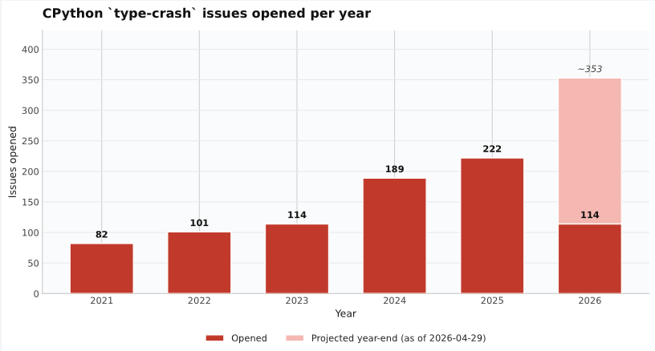
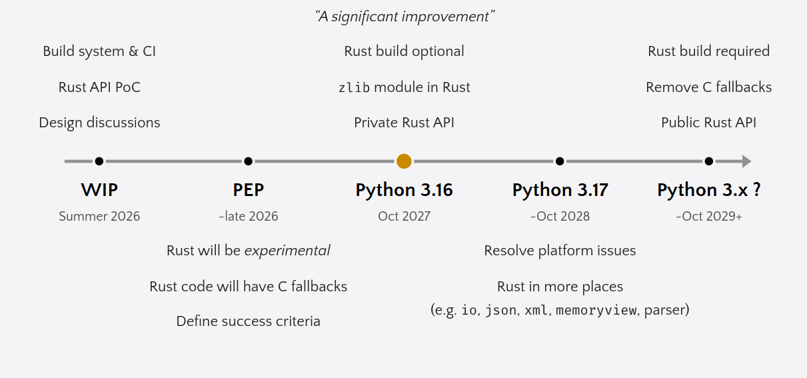

# Rust for CPython

“No one said ‘don’t do this’ last year”. After [testing the waters at PyCon US 2025](https://pyfound.blogspot.com/2025/06/python-language-summit-2025-what-do-core-developers-want-from-rust.html), David Hewitt returned to the Python Language Summit asking what Python core developers want from Rust, along with proposed timelines, phases, and success criteria for how the Rust for CPython project might proceed and become a permanent fixture within the CPython project.

David is acting as an “ambassador” for the Rust for CPython project team, which is currently led by core developers [Kirill Podoprigora](https://github.com/eclips4) and [Emma Smith](https://github.com/emmatyping) as [authors of the Rust for CPython PEP draft](https://discuss.python.org/t/pre-pep-rust-for-cpython/104906). Emma also [spoke at PyCon US 2026](https://www.youtube.com/watch?v=42kibVnUHYE) about the Rust for CPython project. The team itself is around 60 developers in a Discord channel, among them a “few [Python] core developers” and a “delegation from the Rust project”. The team has experience with previous projects integrating Rust into existing codebases, such as Android and the Linux kernel, and is “excited by the work and keen to support [the project] if we proceed”.


## Why Rust?



Showing how adopting Rust may specifically help CPython, David noted how the number of issues labeled with “[`type-crash`](https://github.com/python/cpython/issues?q=is%3Aissue%20state%3Aopen%20label%3Atype-crash)” has been steadily rising over time. “We’ve been making some big technical bets”, he said, referencing the [new parser](https://peps.python.org/pep-0617/), the [JIT](https://peps.python.org/pep-0744/), and [free-threading](https://peps.python.org/pep-0703/). These large, complex features may be one of the reasons more crash reports are being opened on GitHub, and Rust could be a potential solution here. David explained that Jeff Vander Stoep described Rust in Android as “move fast and fix things”, and that “fewer revisions for patches of the same size” was the experience Android has had since adopting Rust.

Rust and Python are already working together in Python’s ecosystem of packages thanks to [PyO3](https://pyo3.rs) and [Maturin](https://pypi.org/project/maturin). David also emphasized that many technology companies were “choosing Rust as a bet” instead of only as the new shiny tool.

But adopting Rust into CPython would not all be smooth sailing; there were still concerns that David and the team are aware of.

One of the biggest concerns from a year ago was Rust’s lack of platform support compared to CPython, which at the time of writing [officially supports 20 different architectures and platforms](https://peps.python.org/pep-0011) at either Tier 1, 2, or 3. David shared that Rust’s support of different platforms has “widened since last year” and was becoming “less and less of a concern”. The proposal would be to ask Python distributors to attempt using the optional Rust support in Python 3.16 (October 2027) and report platform-specific issues upstream in time to be resolved around the Python 3.17 timeline (October 2028).

David acknowledged that adopting Rust into a project is a social challenge as much as a technical challenge. Rust knowledge is “not universal amongst core developers”, which would be partially mitigated by “targeting small portions” of CPython and an incremental approach, as “1 million lines of C code can’t be ported all at once”.

David was clear that using Rust in itself does not necessarily mean that ported code would be free of bugs or security issues. Although Rust does mitigate classes of issues that commonly create bugs, the code can still have correctness issues. The team proposes mitigating this by adopting property-based testing, fuzzing, and using “prudent engineering practices” during the porting process.


## The proposed first Rust module: zlib

Below are the proposed timelines for the Rust for CPython project making a “significant improvement” to CPython, with a PEP defining the success criteria for Rust expected in late 2026. Under this timeline, the first Rust code to ship in Python would be in Python 3.16, where it would be completely optional, with the existing C code kept as a fallback. The earliest that Rust would become required to build CPython is Python 3.18 in 2029, at least three years away.



The timeline includes a build system and CI, Rust API proof-of-concept happening
in the Summer 2026, a PEP defining success criteria in late 2026,
an optional Rust backend for the zlib module and private Rust API in Python 3.16 (October 2027),
resolving platform issues and Rust in more places (json, xml, memoryview, parser)
for Python 3.17 (October 2028). Finally, in some distant Python version (October 2029+)
the Rust build would be made required and a public Rust API would be published.

The Rust for CPython team has selected the [`zlib` module](https://docs.python.org/3/library/zlib.html) as the first module to be given an optional Rust implementation because they “wanted to achieve a significant improvement” with a “small scope”. The proposed Rust implementation will use [zlib-rs](https://crates.io/crates/zlib-rs), which is “heavily tested and used by the Firefox, uv, and [Cargo](https://doc.rust-lang.org/cargo/)” projects and “faster than zlib and zlib-ng on many platforms”. The module was also selected because it’d require using an external Cargo package, meaning this aspect of the build process would need to be designed and exercised.

This small change would have an impact: the zlib compression algorithm is “widely used by Python packaging”, meaning that (almost) “every `pip install` in Python 3.16 will be sped up” if the proposal is accepted.


## Rust API Sketch

David provided an example of some Rust code calling a hypothetical Rust API for Python. The API would use a Rust attribute (`#[pyfunction]`) and be similar to [Argument Clinic](https://devguide.python.org/development-tools/clinic/), a development tool for automatically generating blocks of code for handling C function arguments from Pythonic function syntax. Rust functions would always be passed the thread and interpreter state (`Python<'_>`), use smart pointers around objects (`Py<...>`), and lean into Rust error handling with the [`Result`](https://doc.rust-lang.org/std/result/) enum, returning either a result or an error that was raised.

```rust
#[pyfunction(signature = (
    data,
    /,
    wbits=MAX_WBITS,
    bufsize=DEF_BUF_SIZE,
))]
fn decompress(
    py: Python<'_>,
    data: Py<PyObject>,
    wbits: c_int,
    bufsize: isize
) -> PyResult<Py<PyBytes>, PyErrRaised> {

    // buf will be cleaned on scope exit
    let buf = PyObject::get_buffer(py, &data)?;
    let decoded = /* ... */;

    Ok(PyBytes::new(py, &decoded))
}
```

The example above shows a buffer being allocated and automatically cleaned up on scope exit, rather than being cleaned up manually as would be required when writing the same function in C.


## Proposed success criteria

David moved on to success criteria: what would the Rust for CPython project need to show to move into new phases of the roadmap and eventually become a required part of building CPython? “For previous big changes like the JIT and free-threading, we’ve explicitly defined success criteria that would need to be met in order for the added complexity to be accepted”, David explained, “we expect we’d need to do the same here. What should those criteria be?”

David had these suggestions for core developers:

* **Critical:** A majority of active core developers are *open* to using the Rust API to implement functionality.
* No meaningful slowdown to CPython performance benchmarks.
* All tiered platforms must be supported by Rust. The experience of distributors building CPython should generally indicate that adding Rust support is manageable.

David noted that the first point reads “open”, not “familiar”, and shared a plan to survey Python core developers about how they’ve used Rust while contributing to CPython when deciding whether to move Rust out of experimental stages.

## Discussion

On the topic of designing the new Rust API so that it’s “familiar” to users of the C API, Thomas Wouters advised against “making compromises for the dinosaurs”, including himself in the subset, instead asking whether the Rust API should be designed from first principles. David Hewitt responded that there are “places to lean into Rust”, such as dropping resources on scope exit, but there are also idiomatic Rust designs which “won’t be the best fit”. David noted that it would be reasonable for core developers to be looking at both the C and Rust API at the same time while working. “We should be mindful of our audience, which is also ourselves”.

Larry Hastings asked why the Rust for CPython project wasn’t a “rewrite”, suggesting the team “display your success as a fork”. David acknowledged that “[RustPython](https://github.com/RustPython/RustPython) already exists” and that the Rust for CPython team had already spoken with the contributors of the project. “RustPython isn’t as performant as CPython, but could be used to inform what APIs we design”.

Larry also shared that he “wasn’t super excited to learn Rust to work on CPython”. David assured him that there are many areas of CPython that would not be considered for writing in Rust: “CPython should not be written in Rust for the sake of Rust”. “CPython will be a dual-language project for a meaningful amount of time”. However, David cautioned that “it would be disingenuous to say that Rust would be optional forever”, as one of the aforementioned roadmap items for the Rust for CPython project is to become a required part of the build process and provide a public Rust API.

Pablo Galindo Salgado was more concerned about the future, which was “reaching for our dependencies from Cargo”, noting that this would be a “huge problem” and a potential “showstopper” for the project. “We vendor our dependencies, and we have a very selective set”, he said, noting that each time a vulnerability is published for one of those projects, the release managers need to make new releases, which can be “tiresome”. “Right now we’re only focusing on the APIs and the basics”, he added, highlighting that the challenge of taking on many Rust dependencies hasn’t been addressed yet.

David Hewitt answered that the team should “select as few external dependencies as possible”; “zlib-rs is only one dependency”, and the Rust sources would be vendored so that “building CPython would not require Cargo”. David added that “Cargo has a relatively clean system for vendoring dependencies” and that the “Rust for CPython proof-of-concept uses this system”. The vendored sources “wouldn’t live in the CPython tree”. Łukasz Langa agreed that “it’s better for dependencies to live separately”, referencing the [cpython-source-deps repository](https://github.com/python/cpython-source-deps), with Thomas reminding everyone that this would be a new usage of that repository; today it is only used for binary installers of CPython.
