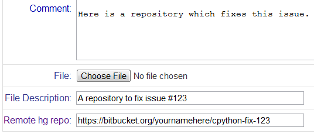

Long-time friends of the Python community, Atlassian (makers of [Bitbucket](http://www.bitbucket.org/)) recently made available a mirror of [http://hg.python.org](http://hg.python.org/), synchronized hourly, for your cloning and hacking pleasure. Using [the new mirror](https://bitbucket.org/python_mirrors) should be very intuitive for current users of the Hg repository -- the projects housed in the mirror follow the same naming convention as the repository they're mirroring. So, the CPython source code is mirrored at [https://bitbucket.org/python\_mirrors/cpython](https://bitbucket.org/python_mirrors/cpython), corresponding to its canonical home at [http://hg.python.org/cpython](http://hg.python.org/cpython). Since it's hosted on Bitbucket, the collaborative floodgates are effectively flung open. Not only is it dead easy to clone and submit contributions back to the project, you'll also have the ability to follow the project and receive updates in your dashboard. If RSS is more your style, Bitbucket makes it easy to stay up-to-date with changes via each repository's feed. If you cloned the cpython repo and want to submit your changes to an issue on [http://bugs.python.org](http://bugs.python.org/), it's as simple as pasting a link to your Bitbucket clone in the "Remote hg repo" box. The default branch is automatically chosen, but appending #branchname to the end of your link will choose that branch.  
  
See how easy it is to get your changes associated with an issue? If you're interested in getting started with CPython development, check out our [developer guide](http://docs.python.org/devguide).  

* * *

Atlassian has been a user of Python and supporter of the Python community for some time now. They've sponsored PyCons around the world as well as events at those conferences, from the CodeWars competitions during PyCon AU to the recent PyLadies party at PyCon US! Thanks, Atlassian!
