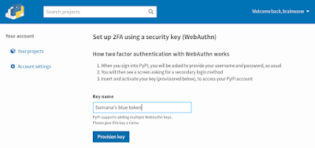
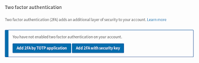

To further increase the security of Python package downloads, we're adding a new beta feature to the Python Package Index: WebAuthn support for U2F compatible hardware security keys as a two-factor authentication (2FA) login security method. This is thanks to a [grant from the Open Technology Fund](https://pyfound.blogspot.com/2019/03/commencing-security-accessibility-and.html), coordinated by the [Packaging Working Group](https://wiki.python.org/psf/PackagingWG) of the [Python Software Foundation](https://www.python.org/psf-landing/). Last month, we [added the first 2FA method](https://blog.python.org/2019/05/use-two-factor-auth-to-improve-your.html) for users logging into the canonical Python Package Index at [PyPI.org](https://pypi.org/) and the test site at [test.pypi.org](https://test.pypi.org/). Hundreds of project owners and maintainers have now started using that method (generating a code through a Time-based One-time Password (TOTP) application) to better secure their accounts. Starting today, PyPI also supports (in beta) WebAuthn (U2F compatible) security keys for a second login factor. A security key (also known as a universal second factor, or U2F compatible key) is hardware device that communicates via USB, NFC, or Bluetooth. Popular keys include Yubikey, Google Titan and Thetis. PyPI supports any [FIDO U2F compatible key](https://fidoalliance.org/specifications/download/) and follows the [WebAuthn standard](https://www.w3.org/TR/webauthn/). Users who have set up this second factor will be prompted to use their key (usually by inserting it into a USB port and pressing a button) when logging in. (This feature requires JavaScript.)  
  
This is a [beta feature](https://wiki.python.org/psf/WarehousePackageMaintainerTesting) and we expect that users will find minor issues over the next few weeks; we ask for your bug reports. If you find any potential security vulnerabilities, please follow our [published security policy](https://pypi.org/security/). (Please don't report security issues in Warehouse via GitHub, IRC, or mailing lists. Instead, please directly email one or more of our maintainers.) If you find an issue that is not a security vulnerability, please [report it via GitHub](https://github.com/pypa/warehouse/issues/new). We encourage project maintainers and owners to log in and [go to your Account Settings to add a second factor](https://pypi.org/manage/account/#two-factor). This will help improve the security of your PyPI user accounts, and thus reduce the risk of vandals, spammers, and thieves gaining account access. If you're not yet comfortable using a beta feature, you can provision a TOTP application for your second factor.  
  
You'll need to verify your primary email address on your Test PyPI and/or PyPI accounts before setting up 2FA. You can also do that in [your Account Settings](https://pypi.org/manage/account/#account-emails). 2FA only affects login via the website, which safeguards against malicious changes to project ownership, deletion of old releases, and account takeovers. Package uploads will continue to work without users providing 2FA codes. But that's just for now. We are working on implementing per-user API keys as an alternative form of multifactor authentication in the setuptools/twine/PyPI auth flows. These will be application-specific tokens scoped to individual users/projects, so that users will be able to use token-based logins to better secure uploads. And we'll move on to working on an advanced audit trail of sensitive user actions, plus improvements to accessibility and localization for PyPI. More details are in [our progress reports](https://discuss.python.org/t/pypi-security-work-multifactor-auth-progress-help-needed/1042). Thanks to the [Open Technology Fund](https://www.opentech.fund/) for funding this work. And please sign up for the [PyPI Announcement Mailing List](https://mail.python.org/mailman3/lists/pypi-announce.python.org/) for future updates.
