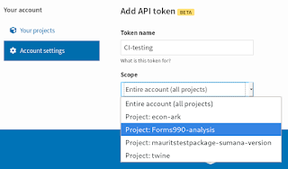
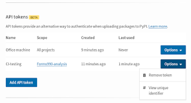
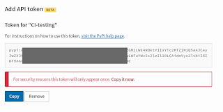

We're [further](https://pyfound.blogspot.com/search/label/pypi) increasing the security of the Python Package Index with another new beta feature: scoped API tokens for package upload. This is thanks to a [grant from the Open Technology Fund](https://pyfound.blogspot.com/2019/03/commencing-security-accessibility-and.html), coordinated by the [Packaging Working Group](https://wiki.python.org/psf/PackagingWG) of the [Python Software Foundation](https://www.python.org/psf-landing/). Over the last few months, we've [added two-factor authentication (2FA) login security methods](https://pyfound.blogspot.com/2019/06/pypi-now-supports-two-factor-login-via.html). We added Time-based One-Time Password (TOTP) support in late May and physical security device support in mid-June. Now, over 1600 users have started using physical security devices or TOTP applications to better secure their accounts. And over the past week, over 7.8% of logins to PyPI.org have been protected by 2FA, up from 3% in the month of June. Now, we have another improvement: [you can use API tokens to upload packages](https://pypi.org/help/#apitoken) to PyPI and [Test PyPI](https://packaging.python.org/guides/using-testpypi/)! And we've designed the token to be a drop-in replacement for the username and password you already use (warning: this is a **beta feature** that [we need your help to test](https://wiki.python.org/psf/WarehousePackageMaintainerTesting)).

<table align="center" cellpadding="0" cellspacing="0"><tbody><tr><td></td></tr><tr><td>PyPI interface for adding an API token for package upload</td></tr></tbody></table>

**How it works:** Go to your [PyPI account settings](https://pypi.org/manage/account/#two-factor) and select "Add API token". When you create an API token, you choose its scope: you can create a token that can upload to all the projects you maintain or own, or you can limit its scope to just one project.  
The token management screen shows you when each of your tokens were created, and last used. And you can revoke one token without revoking others, and without having to change your password on PyPI and in configuration files.  

<table align="center" cellpadding="0" cellspacing="0"><tbody><tr><td></td></tr><tr><td>PyPI API token management interface</td></tr></tbody></table>

  
Uploading with an API token is currently optional but encouraged; in the future, PyPI will set and enforce a policy requiring users with two-factor authentication enabled to use API tokens to upload (rather than just their password sans second factor). Watch [our announcement mailing list](https://mail.python.org/mailman3/lists/pypi-announce.python.org/) for future details.

<table align="center" cellpadding="0" cellspacing="0"><tbody><tr><td></td></tr><tr><td>Immediately after creating the API token, PyPI gives the user one chance to copy it</td><td> </td></tr></tbody></table>

**Why:** These API tokens can **only** be used to upload packages to PyPI, and not to log in more generally. This makes it safer to automate package upload and store the credential in the cloud, since a thief who copies the token won't also gain the ability to delete the project, delete old releases, or add or remove collaborators. And, since the token is a long character string (with 32 bytes of entropy and a service identifier) that PyPI has securely generated on the server side, we vastly reduce the potential for credential reuse on other sites and for a bad actor to guess the token.  
**Help us test:** Please [try this out](https://wiki.python.org/psf/WarehousePackageMaintainerTesting)! This is a [beta feature](https://wiki.python.org/psf/WarehousePackageMaintainerTesting) and we expect that users will find minor issues over the next few weeks; we ask for your bug reports. If you find any potential security vulnerabilities, please follow our [published security policy](https://pypi.org/security/). (Please don't report security issues in Warehouse via GitHub, IRC, or mailing lists. Instead, please directly email security@python.org.) If you find an issue that is not a security vulnerability, please [report it via GitHub](https://github.com/pypa/warehouse/issues/new). We'd particularly like testing from:  

-   Organizations that automate uploads using continuous integration
-   People who save PyPI credentials in a .pypirc file
-   Windows users
-   People on mobile devices
-   People on very slow connections
-   Organizations where users share an auth token within a group
-   Projects with 4+ maintainers or owners
-   People who usually block cookies and JavaScript
-   People who maintain 20+ projects
-   People who created their PyPI account 6+ years ago

**What's next for PyPI:** Next, we'll move on to working on an advanced audit trail of sensitive user actions, plus improvements to accessibility and localization for PyPI (some of which have already started). More details are in [our progress reports on Discourse](https://discuss.python.org/t/pypi-security-work-multifactor-auth-progress-help-needed/1042). Thanks to the [Open Technology Fund](https://www.opentech.fund/) for funding this work. And please sign up for the [PyPI Announcement Mailing List](https://mail.python.org/mailman3/lists/pypi-announce.python.org/) for future updates. Written by Sumana Harihareswara, published initially to https://pyfound.blogspot.com/2019/07/pypi-now-supports-uploading-via-api.html
