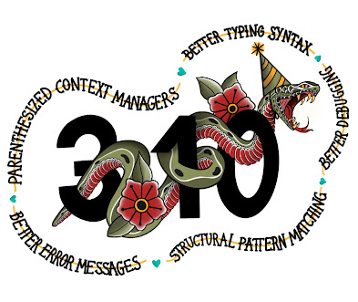

  

On behalf of the Python development community and the Python 3.10 release team, I’m pleased to announce the availability of Python 3.10.0.

Python 3.10.0 is the newest major release of the Python programming language, and it contains many new features and optimizations.

  
[https://www.python.org/downloads/release/python-3100/](https://www.python.org/downloads/release/python-3100/)

## Major new features of the 3.10 series, compared to 3.9

  
Among the new major new features and changes so far:  

-   [PEP 623](https://www.python.org/dev/peps/pep-0623/) – Deprecate and prepare for the removal of the wstr member in PyUnicodeObject.

-   [PEP 604](https://www.python.org/dev/peps/pep-0604/) – Allow writing union types as X | Y

-   [PEP 612](https://www.python.org/dev/peps/pep-0612/) – Parameter Specification Variables

-   [PEP 626](https://www.python.org/dev/peps/pep-0626/) – Precise line numbers for debugging and other tools.

-   [PEP 618](https://www.python.org/dev/peps/pep-0618/) – Add Optional Length-Checking To zip.

-   [bpo-12782](https://bugs.python.org/issue12782): Parenthesized context managers are now officially allowed.

-   [PEP 632](https://www.python.org/dev/peps/pep-0632/) – Deprecate distutils module.

-   [PEP 613](https://www.python.org/dev/peps/pep-0613/) – Explicit Type Aliases

-   [PEP 634](https://www.python.org/dev/peps/pep-0634/) – Structural Pattern Matching: Specification

-   [PEP 635](https://www.python.org/dev/peps/pep-0635/) – Structural Pattern Matching: Motivation and Rationale

-   [PEP 636](https://www.python.org/dev/peps/pep-0636/) – Structural Pattern Matching: Tutorial

-   [PEP 644](https://www.python.org/dev/peps/pep-0644/) – Require OpenSSL 1.1.1 or newer

-   [PEP 624](https://www.python.org/dev/peps/pep-0624/) – Remove Py\_UNICODE encoder APIs

-   [PEP 597](https://www.python.org/dev/peps/pep-0597/) – Add optional EncodingWarning

More resources

-   [Online Documentation](https://docs.python.org/3.10/)

-   [PEP 619](https://www.python.org/dev/peps/pep-0619/), 3.10 Release Schedule

-   Report bugs at [https://bugs.python.org](https://bugs.python.org/).

-   [Help fund Python and its community](https://www.python.org/psf/donations/).

[bpo-38605](https://bugs.python.org/issue38605): `from __future__ import annotations` ([PEP 563](https://www.python.org/dev/peps/pep-0563/)) used to be on this list in previous pre-releases but it has been postponed to Python 3.11 due to some compatibility concerns. You can read the Steering Council communication about it [here](https://mail.python.org/archives/list/python-dev@python.org/thread/CLVXXPQ2T2LQ5MP2Y53VVQFCXYWQJHKZ/) to learn more.

## And now for something completely different

For a Schwarzschild black hole (a black hole with no rotation or electromagnetic charge), given a free fall particle starting at the event horizon, the maximum propper time (which happens when it falls without angular velocity) it will experience to fall into the singularity is \`π\*M\` ([in natural units](https://en.wikipedia.org/wiki/Natural_units)), where M is the mass of the black hole. For Sagittarius A\* (the black hole at the centre of the milky way) this time is approximately 1 minute.

  
Schwarzschild black holes are also unique because they have a space-like singularity at their core, which means that the singularity doesn't happen at a specific point in \*space\* but happens at a specific point in \*time\* (the future). This means once you are inside the event horizon you cannot point with your finger towards the direction the singularity is located because the singularity happens in your future: no matter where you move, you will "fall" into it.  

## We hope you enjoy the new releases!

Thanks to all of the many volunteers who help make Python Development and these releases possible! Please consider supporting our efforts by volunteering yourself or through organization contributions to the Python Software Foundation.  
[https://www.python.org/psf/  
](https://www.python.org/psf/)

Your friendly release team,  
[Ned Deily @nad](https://discuss.python.org/u/nad)  
[Steve Dower @steve.dower](https://discuss.python.org/u/steve.dower)  
[Pablo Galindo Salgado @pablogsal](https://discuss.python.org/u/pablogsal)
