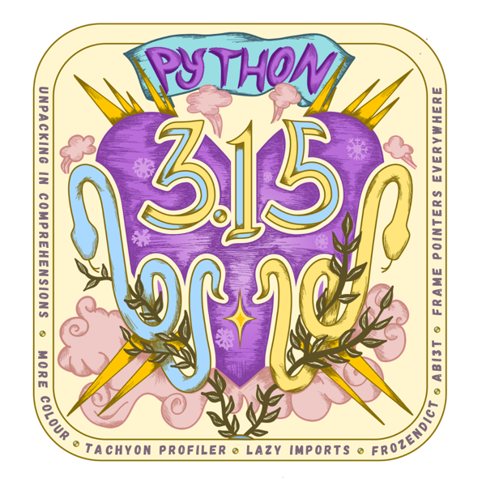

## Python 3.15.0 is now available
[python.org/downloads/release/python-3150/](https://www.python.org/downloads/release/python-3150/)

## This is the stable release of Python 3.15.0

Python 3.15.0 is the newest major release of the Python programming language,
and it contains many new features and optimisations compared to Python 3.14,
in 5,643 commits from 1,012 contributors.

## Major new features of the 3.15 series, compared to 3.14

Some of the major new features and changes in Python 3.15 are:

### Interpreter improvements

* [PEP 661](https://docs.python.org/3/whatsnew/3.15.html#whatsnew315-sentinel): Add `sentinel` built-in type
* [PEP 686](https://docs.python.org/3/whatsnew/3.15.html#whatsnew315-utf8-default): Python now uses UTF-8 as the default encoding
* [PEP 798](https://docs.python.org/3/whatsnew/3.15.html#whatsnew315-unpacking-in-comprehensions): Unpacking in comprehensions
* [PEP 810](https://docs.python.org/3/whatsnew/3.15.html#whatsnew315-lazy-imports): Explicit lazy imports for faster startup times
* [PEP 814](https://docs.python.org/3/whatsnew/3.15.html#whatsnew315-frozendict): Add `frozendict` built-in type
* [PEP 829](https://peps.python.org/pep-0829/): Package startup configuration files
* The [experimental JIT compiler](https://docs.python.org/3/whatsnew/3.15.html#whatsnew315-jit) has been significantly upgraded, with 7-8% geometric mean performance improvement on x86-64 Linux over the standard interpreter, and 11-12% speedup on AArch64 macOS over the tail-calling interpreter
* [Improved error messages](https://docs.python.org/3/whatsnew/3.15.html#improved-error-messages)

### Significant improvements in the standard library

* [PEP 799](https://docs.python.org/3/whatsnew/3.15.html#whatsnew315-profiling-package): A dedicated profiling package for organizing Python profiling tools
* [PEP 799](https://docs.python.org/3/whatsnew/3.15.html#whatsnew315-sampling-profiler): Tachyon: High frequency statistical sampling profiler
* [More color](https://docs.python.org/3/whatsnew/3.15.html#whatsnew315-more-color)

### New typing features

* [PEP 728](https://peps.python.org/pep-0728/): `TypedDict` with typed extra items
* [PEP 747](https://docs.python.org/3/whatsnew/3.15.html#typing): Annotating type forms with `TypeForm`
* [PEP 800](https://peps.python.org/pep-0800/): Disjoint bases in the type system

### C API improvements

* [PEP 782](https://docs.python.org/3/whatsnew/3.15.html#whatsnew315-pybyteswriter): A new `PyBytesWriter` C API to create a Python bytes object
* [PEP 788](https://docs.python.org/3/whatsnew/3.15.html#whatsnew315-c-api-interpreter-finalization): Protection against finalization in the C API
* [PEP 803, 820, 793](https://docs.python.org/3/whatsnew/3.15.html#whatsnew315-abi3t): Stable ABI for free-threaded builds and related C API

### Build changes

* [PEP 831](https://docs.python.org/3/whatsnew/3.15.html#whatsnew315-frame-pointers): Frame pointers are enabled by default for improved system-level observability

### Release changes

* The official Windows 64-bit binaries now [use the tail-calling interpreter](https://docs.python.org/3/whatsnew/3.15.html#whatsnew315-windows-tail-calling-interpreter)
* The official macOS binaries now install free-threading support by default

For more details on the changes to Python 3.15, see [What’s new in Python 3.15](https://docs.python.org/3/whatsnew/3.15.html).

### Attention macOS 27.0 `IDLE` or `tkinter` users

When running IDLE or other GUI applications that use the `tkinter` module, these applications may hang when using an application's menu command that opens a dialog (for example, IDLE's `About IDLE`, `Settings`, and `Open Module` commands) resulting in a spinning beach ball with `Force Quit` needed.

This problem is due to an operating system behavior change in macOS 27.0 that is believed to affect all current versions of the Tk graphics toolkit and thus the `tkinter` module in all current Python versions.

If you depend on Tk-based applications (like IDLE) on macOS, you may want to consider deferring installing macOS 27.0 until a Tk or macOS workaround is available or testing that your application workflow is not affected. Follow issue [#158053](https://github.com/python/cpython/issues/158053) for updates.

## More resources

* [Online documentation](https://docs.python.org/3/)
* [PEP 790](https://peps.python.org/pep-0790/), 3.15 release schedule
* Report bugs at [github.com/python/cpython/issues](https://github.com/python/cpython/issues)
* [Help fund Python directly](https://www.python.org/psf/donations/python-dev/) (or via [GitHub Sponsors](https://github.com/sponsors/python)) and support [the Python community](https://www.python.org/psf/donations/)

# And now for something completely different

To celebrate the new 3.15, Barry Warsaw has a present for us!

> I had this idea to whip up a little TUI adventure game that takes you through a What’s New in Python 3.15. I present to you “whatsnewt”:
>
> From the README:
>
> > A TUI text adventure through what’s new in Python 3.15.
> >
> > You wake up in the Startup Foyer, somewhere inside the interpreter, and work your way to the Release Gate. Along the way there are eighteen puzzles, and every one of them is a real 3.15 feature you have to actually use. You’re not just answering boring questions, you’re actually writing and running code, in a Python 3.15 interpreter.
> >
> > Some puzzles require a type checker, and in those cases, answers are verified by pyrefly, which is a dependency for exactly that reason, and the verdict quotes what it says back.
>
> The easiest way to play it is to run:
>
> `uvx --python 3.15 whatsnewt`
>
> And yes, there are easter eggs

## Enjoy the new release

Thanks to all of the many volunteers who help make Python development and these releases possible! Please consider supporting our efforts by volunteering yourself or through organisation contributions to the [Python Software Foundation](https://www.python.org/psf-landing/).

Huge thanks to Georgi Ker and Marie Nordin for the Python 3.15 logo!

And also huge thanks to the Sovereign Tech Agency for supporting my work as release manager
for Python 3.14 and 3.15 through the [Sovereign Tech Fellowship](https://www.sovereign.tech/programs/fellowship).

Salutations de Rennes,

Your release team,
 Hugo van Kemenade
 Ned Deily
 Steve Dower
