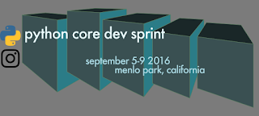
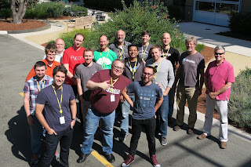

From September 5th to the 9th a group of Python core developers gathered for a sprint hosted at Instagram and sponsored by [Instagram](https://www.instagram.com/), [Microsoft](http://landinghub.visualstudio.com/python), and the [Python Software Foundation](https://www.python.org/psf/). The goal was to spend a week working towards the Python 3.6b1 release, just in time for the Python 3.6 feature freeze on Monday, September 12, 2016. The inspiration for this sprint was the [Need for Speed sprint](https://lwn.net/Articles/185399/) held in Iceland a decade ago, where many performance improvements were made to Python 2.5. How time flies!

  

By any measurement, the sprint was extremely successful. All participants left feeling accomplished both in the work they did and in the discussions they held. Being in the same room encouraged many discussions related to various [PEPs](https://www.python.org/dev/peps/), and many design decisions were made. There was also the camaraderie of working in the same room together — typically most of us only see each other at the annual PyCon US, where there are other distractions that prevent getting to simply spend time together. (This includes the Python development sprints at PyCon, where the focus is more on helping newcomers contribute to Python — that’s why this sprint was not public.)

  

From a quantitative perspective, the sprint was the most productive week for Python ever! According to the graphs from the GitHub mirror of CPython, the week of September 4th saw [more commits](https://github.com/python/cpython/graphs/commit-activity) than the preceding 7 weeks combined! And in [terms of issues](http://bugs.python.org/issue?@template=stats), the number of open issues dropped by 62 with a total of 166 issues closed.

  

A large portion of the work performed during the sprint week revolved around various PEPs that had either not yet been accepted or were not yet fully implemented. In the end, 12 PEPs were either implemented from scratch or had their work completed during the week, out of Python 3.6’s total of 16 PEPs:

  

1.  Preserving the order of \*\*kwargs in a function ([PEP 468](https://www.python.org/dev/peps/pep-0468/))
2.  Add a private version to dict ([PEP 509](https://www.python.org/dev/peps/pep-0509/))
3.  Underscores in Numeric Literals ([PEP 515](https://www.python.org/dev/peps/pep-0515/))
4.  Adding a file system path protocol ([PEP 519](https://www.python.org/dev/peps/pep-0519/))
5.  Preserving Class Attribute Definition Order ([PEP 520](https://www.python.org/dev/peps/pep-0520/))
6.  Adding a frame evaluation API to CPython ([PEP 523](https://www.python.org/dev/peps/pep-0523/))
7.  Make os.urandom() blocking on Linux, add os.getrandom() ([PEP 524](https://www.python.org/dev/peps/pep-0524/))
8.  Asynchronous Generators ([PEP 525](https://www.python.org/dev/peps/pep-0525/))
9.  Syntax for Variable Annotations ([PEP 526](https://www.python.org/dev/peps/pep-0526/))
10.  Change Windows console encoding to UTF-8 ([PEP 528](https://www.python.org/dev/peps/pep-0528/))
11.  Change Windows filesystem encoding to UTF-8 ([PEP 529](https://www.python.org/dev/peps/pep-0529/))
12.  Asynchronous Comprehensions ([PEP 530](https://www.python.org/dev/peps/pep-0530/))

  

Some large projects were also worked on that are not represented as PEPs. For instance, Python 3.6 now contains support for [DTrace](https://en.wikipedia.org/wiki/DTrace) and [SystemTap](https://en.wikipedia.org/wiki/SystemTap). This will give people more tools to introspect and monitor Python. See the [HOWTO](https://docs.python.org/3.6/howto/instrumentation.html) for usage instructions and examples showing some of the new possibilities.

  

CPython also gained a more memory efficient dictionary implementation at the sprint. The new implementation shrinks memory usage of dictionaries by about 25% and also preserves insertion order, without speed penalties. Based on [a proposal](https://mail.python.org/pipermail/python-dev/2012-December/123028.html) by Raymond Hettinger, the patch was written by INADA Naoki prior to the sprint but it was reviewed and heavily discussed at the sprint, as changing the underlying implementation of dictionaries can have profound implications on Python itself. In the end, the patch was accepted, directly allowing for PEP 468 to be accepted and simplifying PEP 520.

  

Work was also done on the Gilectomy (see the [presentation](https://www.youtube.com/watch?v=P3AyI_u66Bw) on the topic from PyCon US for more background info on the project). Progress was made such that Python would run without any reference counting turned on (i.e. Python turned into a huge memory leak). Work then was started on trying the latest design on how to turn reference counting back on in a way that would allow Python to scale with the number of threads and CPU cores used. There’s still a long road ahead before the Gilectomy will be ready to merge though, and we even jokingly considered branding the result as Python 4.

  

Much of the work done during the sprint led not only to improvements in the language and library, but to better performance as well. A [quick performance comparison](https://gist.github.com/brettcannon/b57a86a41b4eb0ea64c3b837690c9662) between Python 3.5.2+ and 3.6b1+ under OS X shows that 3.6 is generally faster, with double-digit speed improvements not uncommon. Similar benchmarking under Windows 10 has been reported to show similar performance gains.

  

A huge thanks goes out to the participants of the sprints! They are listed below in alphabetical order, along with thanks to the organizations that helped finance their attendance. Many of them traveled to attend and gave up the US Labor Day holiday with their families to participate. In the end, we had participants from 3 countries on 2 continents (We actually invited more people from other countries and continents, but not everybody invited could attend.)

  

-   Brett Cannon (Microsoft)
-   Ned Deily
-   Steve Dower (Microsoft)
-   Larry Hastings
-   Raymond Hettinger
-   Senthil Kumaran
-   Łukasz Langa (Instagram)
-   R. David Murray
-   Benjamin Peterson
-   Davin Potts
-   Lisa Roach (Cisco)
-   Guido van Rossum
-   Yury Selivanov (magic.io)
-   Gregory P. Smith (Google)
-   Eric Snow (Canonical)
-   Victor Stinner (Red Hat)
-   Zachary Ware

  

Special thanks to Łukasz for making the event happen and to Larry for designing the logo.

  

