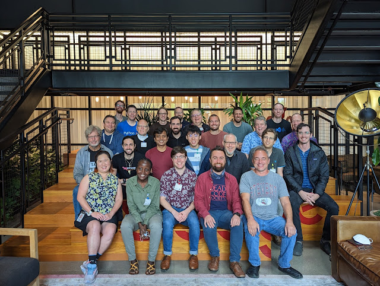

From October 3rd to October 7th a group of Python core developers gathered for a sprint hosted at Google. The event was mainly sponsored by Google and the Python Software Foundation. The core team used to do this annually between 2016 and 2019. It was high time to return to this tradition as the remote online sprints organized in years 2020 and 2021 proved to be a poor substitution for in-person collaboration.

Participating in a core sprint that isn't following a public tech conference is unique in many ways. We come fresh and ready to work on Python for the entire week, without the brain fog that builds up during a multi-day conference. With other contributors there with us, it's easier to focus on the task at hand without professional or private interruptions. Finally, on a human level, we really missed each other. And some of us never met in real life before.

The sprint was the most active week on the repository in five years. It managed to overshadow [the sprint at Meta in 2016](https://blog.python.org/2016/09/python-core-development-sprint-2016-36.html) which happened shortly before the 3.6 beta freeze, at the time said to be "the most productive \[single\] week for Python ever". During the five days of the sprint there were 344 commits to our five active branches that span versions of Python from 3.7 to 3.12. 157 of those were made to the `main` branch alone, which will end up being Python 3.12. Some fixes were pretty deep, like the [sneaky 3.11 crasher](https://github.com/python/cpython/pull/97996) that only reproduces when performing a full pytest run on a large async app, and disappears once you start diagnosing it. Progress was made on putting full f-string parsing into the grammar of the language, which will allow some new constructs that I'm sure will raise more than one eyebrow when the time comes!

Using the opportunity of meeting in person, the sprint week contained some additional events like a Q&A meeting between the core developers and the Steering Council. We discussed the process for core mentorship, open undecided PEPs like PEP 649, or the future of the C API. To be clear, no decisions about the Python programming language are made behind closed doors. The meetings during the sprint help reaching consensus but continue in our dedicated online communications channels like [discuss.python.org](https://discuss.python.org/) and the [python-dev mailing list](https://www.python.org/community/lists/). All changes require opening [issues on GitHub](https://github.com/python/cpython/issues), and larger ones require going through [the PEP process](https://peps.python.org/pep-0001/).

A few interest groups gathered to meet during the sprint as well. Most of those meetings were hybrid, meaning that they included remote participants dialing in. The documentation experts, the core workflow experts, the asyncio experts, the code of conduct working group, and the C API interest group all met to discuss their respective topics.

One highlight of the event that most participants brought up is rapid knowledge sharing that it allowed. Pair programming, whiteboard design, or simply talking somebody through a problem, happened often. Among the topics in this vein the [eval breaker](https://github.com/python/cpython/blob/c2370763793734aa6be8dbc326b70132770eaeaa/Python/ceval.c#L1141) came up often, as did asyncio and typing topics. Ken Jin presented a summary of the performance improvements coming in Python 3.11, and Dustin Ingram talked about Sigstore for Python releases. Speaking of security, Google provided core developers attending the sprint with FIDO2 hardware security keys to additionally secure their access to GitHub and PyPI.

Some work looks further into the future. Ken Jin and C.A.M. Gerlach authored [a new PEP](https://peps.python.org/pep-0699/) during the sprint as well, and [PEP 688](https://peps.python.org/pep-0688/) received a rewrite from Jelle Zijlstra. Carl Meyer worked on dict watchers and [callbacks when a type is modified](https://github.com/python/cpython/pull/97875), both needed to allow for a pluggable JIT.

A vote to nominate a new core developer, Alex Waygood, [was opened during the sprint](https://discuss.python.org/t/vote-to-promote-alex-waygood/19690?u=ambv) and passed unanimously. Alex was present at the sprint as a collaborating triager and mentee.

Huge thanks to everybody that participated! The list below is in alphabetical order, along with thanks to the organizations that helped finance their attendance. We also acknowledge that travel for a multi-day event separates people from their families. We're grateful for their understanding. In the end, we had 28 in-person participants from 8 countries on 3 continents:

-   Brandt Bucher
-   Brett Cannon (Microsoft)
-   Ned Deily
-   Martin Demello (Google)
-   C.A.M. Gerlach
-   Larry Hastings
-   Dustin Ingram (Google)
-   Ken Jin
-   Hugo van Kemenade
-   Senthil Kumaran
-   Łukasz Langa
-   Carl Meyer (Meta)
-   Joannah Nanjekye
-   Lysandros Nikolaou
-   Benjamin Peterson
-   Guido van Rossum (Microsoft)
-   Pablo Galindo Salgado (Bloomberg)
-   Yury Selivanov (EdgeDB)
-   Mariatta (Google)
-   Mark Shannon (Microsoft)
-   Eric Smith
-   Gregory P. Smith (Google)
-   Eric Snow (Microsoft)
-   Barry Warsaw (Microsoft)
-   Alex Waygood
-   Frank Wierzbicki
-   Thomas Wouters (Google)
-   Jelle Zijlstra (Quora)

Special thanks to Greg for making the event happen!
