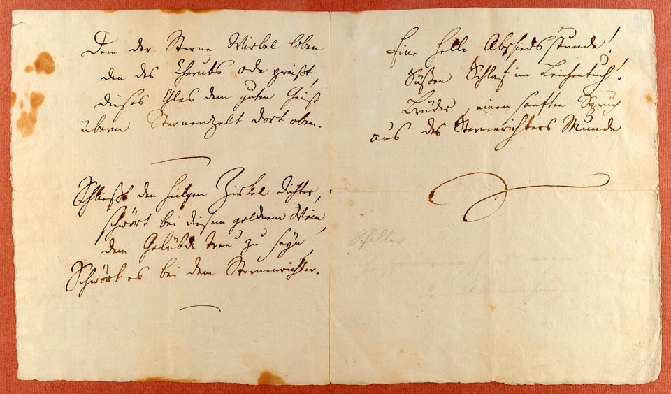

We’re excited to announce that the Python documentation is now available in [German (Deutsch)](https://docs.python.org/de/3/)! 🎉

A huge thank you to everyone who contributed their time and expertise to the
translation effort. Community contributions like these help make Python more
accessible to people around the world!

<figure class="manuscript" style="max-width: 550px; height: auto; margin: 0 auto;">

  

  <figcaption>
    Friedrich Schiller’s handwritten manuscript of <a href="https://en.wikipedia.org/wiki/Ode_to_Joy"><em>An die Freude</em></a> (“Ode to Joy”).
  </figcaption>
</figure>
 

**Did you know?** In German, every noun is capitalized, not just proper names.
Words like Schlange (snake), Zeit (time), and Spaß (fun) always begin with a
capital letter when used as nouns, even in the middle of a sentence!
This capitalization can also help distinguish words that otherwise look identical,
such as essen (“to eat”) and Essen (“food” or the city of Essen).

## Help wanted

Python’s documentation is available in many other languages too, and these
translations depend on contributors to keep them accurate and up to date.
If you’d like to help translate or maintain Python documentation in your language,
see the translation guide in the [Python Developer’s Guide](https://devguide.python.org/documentation/translations/translating/#translating)
and the [Translation dashboard](https://translations.python.org).
