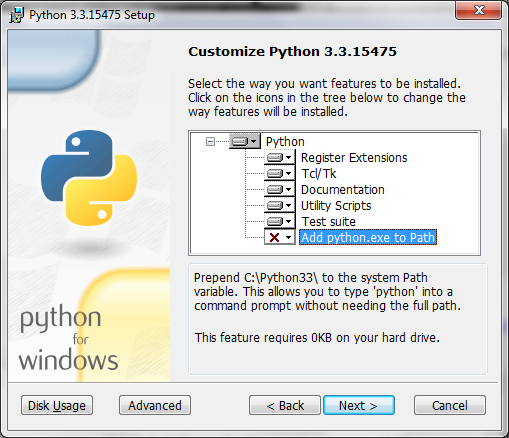

The Windows build of Python 3.3 has recently seen changes that could use a look from the community throughout our alpha and beta cycle. The first change is the long requested addition of Python to the system Path variable, which was completed in the installer. Secondly, the build was upgraded to Visual Studio 2010.

#### Python on the Path

A long requested feature, especially from beginners to those involved in education and training, has been the ability for the Python installer to place itself in the system Path environment variable. Having the following message appear when you try to run a simple exercise is not a great first experience:  

> 'python' is not recognized as an internal or external command, operable program or batch file.

Because of that, the first post-install step by many users is to edit the Path environment variable manually to insert the C:Python33 directory. This allows the user to simply type python on the command line and have it open C:\\\\Python33\\\\python.exe -- a very desirable feature for a majority of users. In fact, it's such a common post-install step that there are a huge amount of tutorials either about this step by itself or tutorials where their setup introduces this step before moving on.  

> 

The easiest part of the whole thing was [the code](http://hg.python.org/cpython/rev/4e9f1017355f). Path manipulation in the installer consists of adding a new feature to the Feature table, then the Environment table may be updated based on selection of the Path feature. If the feature was selected, the Environment table is modified in a way that the Path is prepended to and will be correctly cleaned up on uninstallation. The harder part was deciding how to go about the change. If you're going to provide Path manipulation, the major questions are to do it by default or not, and to prepend or append to the Path. We decided that it wasn't appropriate to make this a default feature. For one, in the dual-version state many users are running in, we run the risk of users running through the installer and putting their system into a state they aren't prepared for. We don't want to change the meaning of python when executed on the command line without the user asking for it. On one hand it's a very beginner focused feature in that it gets a first-timer successfully up and running with ease. However, it's also an advanced feature in that it takes a good understanding of what it's going to do to the users who have 2.6, 2.7, 3.2, and now 3.3 on their machines. We think the best solution for all is to leave it up to them and include an explanation. The other part we had to think about was whether to prepend or append to the path. While some believe that appending to the path is the more friendly way to work with the system, it would seem to be of limited utility given that the feature is added this late in the game. Instead we went the route of prepending the installation folder, e.g., C:\\Python33, in order to make sure this feature is actually useful to our users. If you have questions or comments, please feel free to raise them on python-dev or see [Issue 3561](http://bugs.python.org/issue3561).

#### Transition to Visual Studio 2010

In time for the last alpha release, we've updated our build tools from Visual Studio 2008 to 2010.  
Many potential contributors as well as general Python users have long moved to work environments that use Visual Studio 2010. During a "bug day" some months ago, we had two or three patches come from interested first-timers who found our VS2008 solution not working in VS2010. Over time we received a few more contributions and bug reports on the topic, as well as some chatter in IRC about being behind the curve. On top of that, my employer at the time moved to VS2010 as well as the employers of at least one other core maintainer, so we were already operating on ports for our companies. When it came time to think about what to do for Python 3.3, moving to VS2010 became a *must have* due to our release schedule. Staying with VS2008 for 3.3 would put us into the middle of 2014 as the next time we could release on a new version. That would leave us at least two versions behind, with VS2010 as well as VS11 being available by then. Another reason is the relative ease of porting between VS2010 and VS11. Once we got ourselves on to 2010, moving on to 11 would not be that hard. VS11 currently reads our VS2010 files without change if you want to use the IDE features of VS11. However, there'd need to be another port in order to use the VS11 compiler suite, but it seems to require minimal effort. Just following the VS11 wizard produced a functioning executable, although it didn't build cleanly.

##### Where to get Visual Studio 2010?

As usual, Microsoft provides a zero-cost version of Visual Studio 2010 in the name Visual C++ Express, available at [http://www.microsoft.com/visualstudio/en-us/products/2010-editions/visual-cpp-express](http://www.microsoft.com/visualstudio/en-us/products/2010-editions/visual-cpp-express). While there are [some differences](http://msdn.microsoft.com/en-us/library/hs24szh9\(v=vs.100\).aspx) between the Express version and the for-purchase versions, the Express version is used successfully by many contributors. The fine folks at Microsoft's [Open Source Technology Center](http://www.microsoft.com/en-us/openness/default.aspx#home) have provided the core contributors with MSDN licenses free of charge, allowing for access to the full versions of Visual Studio among other products. The full versions of Visual Studio support 64-bit compilation which comes in handy for our amd64 releases, which have been available since 2.5.

#### Help us out -- try the alphas and betas!

With a change to the installer, a new build system, and the [other great changes](http://docs.python.org/dev/whatsnew/3.3.html) we have in store, the more feedback we hear from the community during the development cycle, the better we can make this release. If you have a chance to run your projects on Python 3.3, [http://bugs.python.org](http://bugs.python.org/) is always open for your reports. You've even got a month to get feature requests in and completed! The last alpha release is scheduled for this weekend, and the first beta release is scheduled for June 24. You can download our 3.3.0 releases at [http://www.python.org/download/releases/3.3.0/](http://www.python.org/download/releases/3.3.0/).
