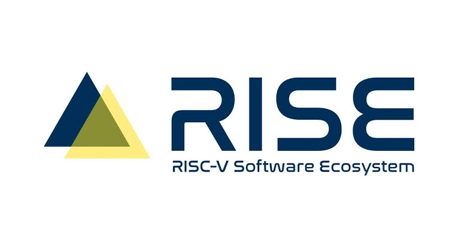

Over the last few months, I’ve been working on improving CPython’s support for
the RISC-V architecture, and I’m thrilled to announce that RISC-V is now
officially supported by CPython as a Tier 3 platform! 🎉 🚀

## What is RISC-V?

[RISC-V](https://riscv.org/) is an open [instruction set architecture (ISA)](https://en.wikipedia.org/wiki/Instruction_set_architecture). Importantly,
unlike proprietary instruction sets (e.g., x86 and ARM), it is developed as an
open standard and can be implemented by anyone.

Its ecosystem has grown considerably in recent years and is [projected to
quadruple by 2032](https://finance.yahoo.com/technology/articles/risc-v-market-projected-quadruple-101200888.html). With that growth, it’s increasingly important that
Python works reliably on these platforms.

## Getting here

This would not have been possible without community contributions. RISC-V support
in CPython has developed over time with people testing on real hardware,
fixing architecture-specific issues, improving build support, reporting bugs,
and reviewing patches. That work is what has brought the platform to the point
where it could be added to [PEP 11](https://peps.python.org/pep-0011/).

A particularly important part of this has been having reliable, ongoing testing
on real RISC-V hardware. I’d like to thank the [RISE Project](https://riseproject.dev/) for their
support. RISE has kindly provided several RISC-V machines for CPython,
giving us Buildbots for testing as well as debugging architecture-specific issues.

I’d especially like to thank [Ludovic Henry](https://fr.linkedin.com/in/ludovic-dev) from the RISE Project,
[Furkan Onder](https://github.com/furkanonder), and [Emma Smith](https://github.com/emmatyping), along with the many others who have
contributed. Additionally, I'm personally grateful for the [Sovereign Tech Agency](https://www.sovereign.tech/),
which through their amazing fellowship supported my work on this.

## What’s next?

While [Tier 3 support](https://peps.python.org/pep-0011/#tier-3) is an important milestone, there’s plenty more to do.
We are currently investigating how to improve our testing further by bringing
RISC-V directly into CPython’s CI, again kindly supported by RISE with their
[RISE RISC-V Runners initiative](https://riscv-runners.riseproject.dev/). This should give contributors faster
feedback than the [Buildbots](https://buildbot.python.org/) (which currently run *after* a patch is merged)
and would allow us to catch RISC-V-specific problems earlier.

In the long term, I’d also love to work towards promoting RISC-V to Tier 2 support.

There are also opportunities to move beyond simply making CPython work on RISC-V.
I’d like to explore architecture-specific optimizations to take better advantage
of RISC-V capabilities where doing so can improve CPython’s performance.

Importantly, we need people to use it and give us feedback. If you have access
to RISC-V hardware, please try building and running CPython, run your workloads
and test suites, and please [let us know what breaks](https://github.com/python/cpython/issues). Testing across
different RISC-V environments will help us make support better for everyone!

CPython is also only one part of the Python ecosystem. Continued community work
across packages, compilers, tooling, and infrastructure will be important in
making RISC-V an increasingly well-supported platform for Python as a whole.

There’s a lot still to do, and I’m looking forward to continuing that work!
