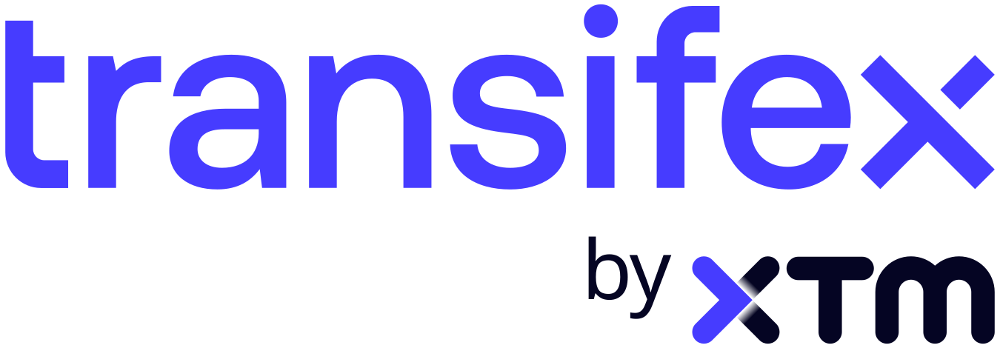

We’re pleased to announce that [Transifex](https://www.transifex.com/) is supporting Python’s
documentation translations by providing its Growth plan, at no cost, for 12 months.

Python’s documentation translation teams help people learn and use Python in
their own language. Several of these teams use Transifex as their translation
platform, working together through its web-based interface.

Following [last year’s paid trial](https://github.com/python/steering-council/issues/297), this sponsorship allows those teams to
continue using features that help them reuse existing translations, maintain
consistent terminology, and catch potential errors.

For developers interested in localizing their own Python applications, Transifex
has also prepared a tutorial on using [Transifex Native](https://www.transifex.com/).

Interested in helping translate Python’s documentation? Visit the [translation
section of the Python Developer’s Guide](https://devguide.python.org/documentation/translations/translating/#translating) and [translations.python.org](https://translations.python.org/)
to find your language’s team and learn how to get involved.

Thank you to Transifex for supporting this work, and to the translators,
reviewers, and coordinators who make Python’s documentation accessible to more
people around the world!
