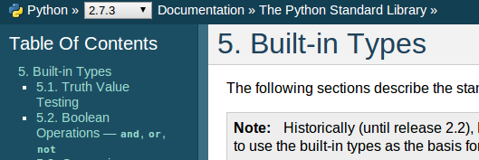
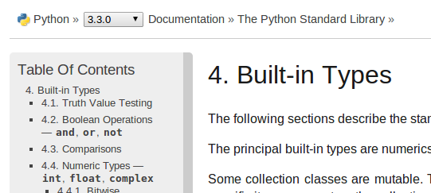

If you haven't already noticed, several months ago we updated the Sphinx theme for documentation of versions Python 3.2 and beyond on [docs.python.org](http://docs.python.org). It's a more modern look, and it also serves as an indicator that you're looking at documentation for a newer version. Thanks go out to Georg Brandl for his work on Sphinx, Python's documentation, and this new theme!  

  

#### PEP 430

  
Over the weekend, [PEP 430](http://www.python.org/dev/peps/pep-0430/) was approved, which changes the default documentation displayed at [http://docs.python.org](http://docs.python.org/). See the PEP for full details, but the jist is that we're now promoting the current Python 3 release as the default when you go to the docs home page. However, as the majority use case is still for Python 2 documentation, navigating straight to an unversioned page will present you with the current Python 2 documentation. For example, an unversioned link such as [http://docs.python.org/library/zipfile](http://docs.python.org/library/zipfile) will bring up the 2.7.3 documentation.

  

#### Version Dropdown

  
Supporting that change is a new feature that adds a version dropdown to the top of all documentation pages. Not only does this help when users are brought to a page which they don't expect, but switching between versions is a common operation as more and more projects work to add support for Python 3. [Issue 8040](http://bugs.python.org/issue8040) is where you'll find discussion on the change and its patches, with the bulk of the work completed by Yury Selivanov with some help from Georg.   
This dropdown is especially handy as you peruse the documentation and come to a page that you want to view in another version. Choosing another version while on any page will load that page's other version, where the latest release of that version is chosen, e.g., 2.7 currently points to 2.7.3. So, as you browse the 2.7.3 built-ins page, choosing 3.3 in the dropdown will bring you to the 3.3.0 built-ins page.   
We hope these changes enhance your experience when browsing the Python documentation!
